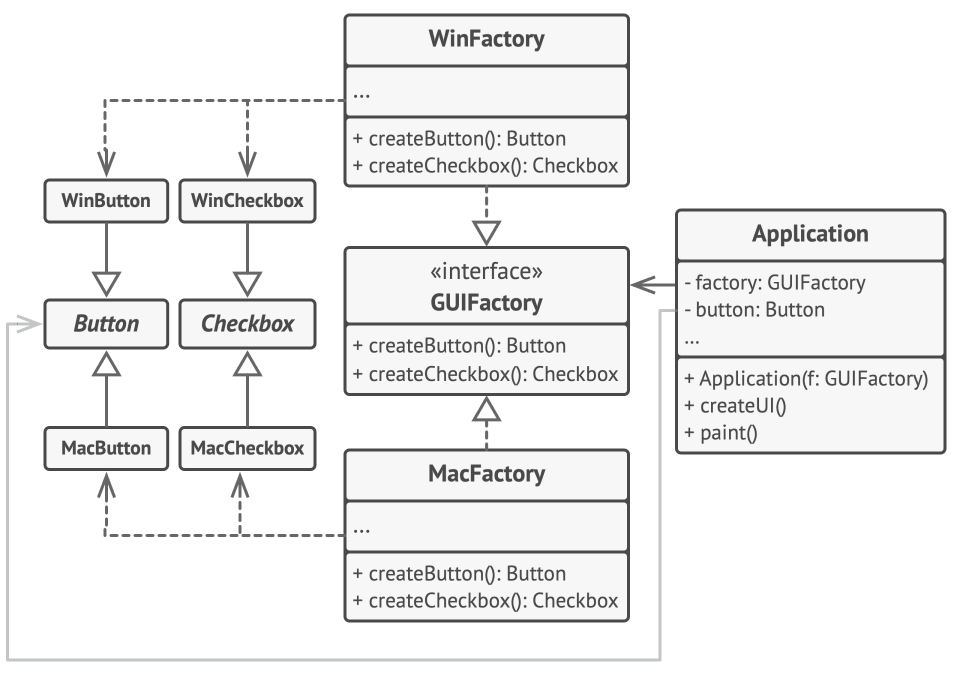
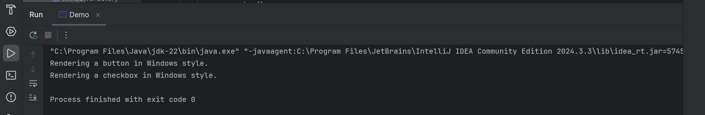
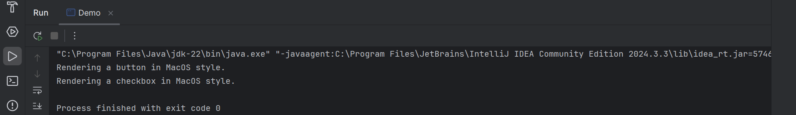

# Abstract Factory Method Pattern (GUI Toolkit Example)

This folder demonstrates the **Abstract Factory Design Pattern** in Java by implementing a simple **GUI Toolkit** that can create buttons and checkboxes for different operating systems.

The Abstract Factory Pattern is a **creational design pattern** that provides an interface for creating **families of related or dependent objects** without specifying their concrete classes. It is especially useful when the system needs to be independent of how its objects are created and represented.

---

## 🎯 Task / Problem Statement

Create a GUI toolkit using the **Abstract Factory Pattern** that supports multiple operating systems.



### Requirements:

1. **Abstract Product Interfaces**
   - Define interfaces for GUI components:
     - `Button`
     - `Checkbox`

2. **Concrete Products**
   - Implement OS-specific components:
     - **Windows**:
       - `WindowsButton`
       - `WindowsCheckbox`
     - **macOS**:
       - `MacOSButton`
       - `MacOSCheckbox`

3. **Abstract Factory Interface**
   - Define `GUIFactory` with methods:
     - `createButton()`
     - `createCheckbox()`

4. **Concrete Factories**
   - Implement factories for each OS:
     - `WindowsFactory`
     - `MacOSFactory`

5. **Client Code**
   - Determine the operating system.
   - Use the corresponding factory to create GUI components.
   - Demonstrate the components using a common method (e.g., `paint()`).

---

## 🗂 Folder Structure

```
Abstract_Factory_Method/
├── README.md
├── src/
│   ├── Application.java
│   ├── Button.java
│   ├── Checkbox.java
│   ├── Demo.java
│   ├── GUIFactory.java
│   ├── MacOSButton.java
│   ├── MacOSCheckbox.java
│   ├── MacOSFactory.java
│   ├── WindowsButton.java
│   ├── WindowsCheckbox.java
│   └── WindowsFactory.java
├── img/
│   ├── output1.png
│   ├── output2.png
│   └── task_diagram.png
└────────────────────────────────
```

- **`src/`** → Contains all Java source files.
- **`img/`** → Contains output screenshots and the task diagram.

---

## ⚙️ How It Works

1. **Abstract Products** define common interfaces for buttons and checkboxes.
2. **Concrete Products** implement these interfaces for specific operating systems.
3. **Abstract Factory (`GUIFactory`)** declares methods to create related GUI components.
4. **Concrete Factories** create OS-specific implementations of buttons and checkboxes.
5. **Client Code** works with factories and products only through interfaces, ensuring loose coupling.

---

## Outputs

The program output when Windows is selected as an operating systems:




The program output when MacOS is selected as an operating systems:



---
