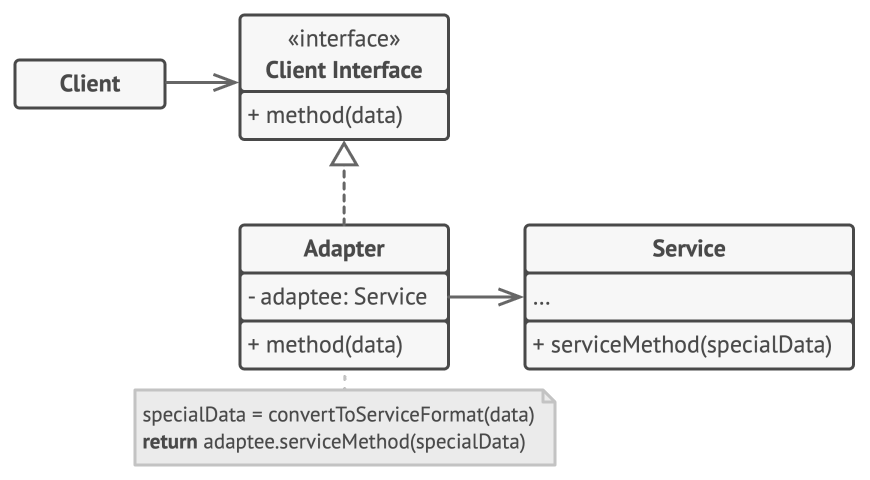
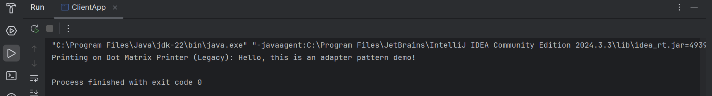

# Adapter Design Pattern (Legacy Printer Integration)

This folder demonstrates the **Adapter Design Pattern** in Java using a **legacy printer integration** example.

The Adapter Pattern is a **structural design pattern** that allows incompatible interfaces to work together. It acts as a bridge between a modern interface expected by the client and an existing (legacy) class with a different interface, without modifying the legacy code.




---

## 🎯 Task / Problem Statement

You have a modern application that expects all printers to implement a standard `Printer` interface. However, there is an existing legacy class `DotMatrixPrinter` that uses a different method (`oldPrint()`).

Since the legacy code **cannot be modified**, an **Adapter** is required to wrap the legacy printer and make it compatible with the modern application.

The Adapter enables the application to use the legacy printer **as if it were a normal `Printer`**.

---

## System Components

### Target Interface
- `Printer` — defines the standard interface expected by the client.

### Adaptee (Legacy Class)
- `DotMatrixPrinter` — existing printer with an incompatible interface (`oldPrint()`).

### Adapter
- `DotMatrixAddapter` — adapts `DotMatrixPrinter` to the `Printer` interface.

### Client
- `ClientApp` — uses the `Printer` interface without knowing about the legacy implementation.

---

## 🗂 Folder Structure

```
Adapter/
├── README.md
├── src/
│   ├── ClientApp.java
│   ├── DotMatrixAddapter.java
│   ├── DotMatrixPrinter.java
│   └── Printer.java
├── img/
│   └── output1.png
└────────────────────────────────
```

- **`src/`** → Contains all Java source files for the Adapter pattern.
- **`img/`** → Contains sample output screenshot.

---

## ⚙️ How It Works

1. The client works only with the `Printer` interface.
2. `DotMatrixAddapter` implements `Printer` and internally uses `DotMatrixPrinter`.
3. Calls to the modern `print()` method are translated into calls to `oldPrint()`.
4. The legacy printer becomes usable without changing its original code.

This approach promotes **reusability**, **loose coupling**, and **clean integration** of legacy systems.

---

## Sample Output

The output of printing through the adapter can be seen below:



---
