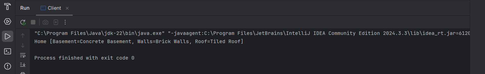

# Builder Pattern (Home Construction Example)

This folder demonstrates the **Builder Design Pattern** in Java using a **Home construction** example.

The Builder Pattern is a **creational design pattern** that separates the construction of a complex object from its representation, allowing the same construction process to create different representations. It is especially useful when an object requires multiple steps to be created.

---

## 🎯 Task / Problem Statement

Consider the construction of a **Home**, which is the final object to be built.

The construction process involves multiple steps such as:
- Basement construction
- Wall construction
- Roof construction

After completing all steps, the fully constructed **Home** object is returned.

Using the same concept, the Builder Pattern can also be applied to build other complex objects (e.g., a Phone with different properties).

---

## 🗂 Folder Structure

```
Builder/
├── README.md
├── src/
│   ├── Client.java
│   ├── ConcreateHomeBuilder.java
│   ├── Home.java
│   ├── HomeBuilder.java
│   └── HomeDirector.java
├── img/
│   └── output1.png
└──────────────────────────────────
```

- **`src/`** → Contains all Java source files related to the Builder Pattern.
- **`img/`** → Contains sample output screenshot.

---

## ⚙️ How It Works

1. **Product (`Home`)**  
   Represents the complex object under construction.

2. **Builder Interface (`HomeBuilder`)**  
   Defines the steps required to build the home.

3. **Concrete Builder (`ConcreateHomeBuilder`)**  
   Implements the building steps and assembles the `Home` object.

4. **Director (`HomeDirector`)**  
   Controls the construction process and ensures steps are executed in order.

5. **Client (`Client`)**  
   Initiates the construction and retrieves the final `Home` object.

This structure allows the construction logic to remain independent of the final object representation.

---

## Output

The output of the home construction process can be seen below:



---
