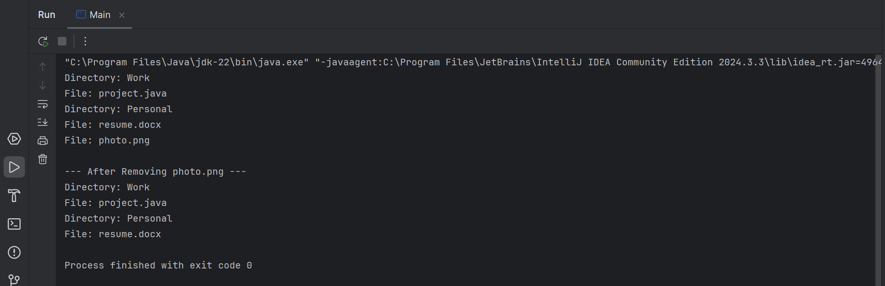

# Composite Design Pattern (File System Example)

This folder demonstrates the **Composite Design Pattern** in Java using a **file system hierarchy** example.

The Composite Pattern is a **structural design pattern** that allows clients to treat **individual objects and compositions of objects uniformly**. It is especially useful when representing part–whole hierarchies such as file systems, UI components, or organizational structures.

---

## 🎯 Task / Problem Statement

Create a file system structure consisting of files and directories using the **Composite Design Pattern**.

### Requirements:
- Define a common component interface for file system elements.
- Implement `File` as a leaf node.
- Implement `Directory` as a composite that can contain files and other directories.
- Add a `remove(FileSystemComponent component)` method to the `Directory` class.
- Verify the output by displaying the file system structure.

---

## System Components

### Component
- `FileSystemComponent` — common interface for both files and directories.

### Leaf
- `File` — represents individual files that do not contain child elements.

### Composite
- `Directory` — can contain multiple `FileSystemComponent` objects (files or directories) and supports adding/removing components.

### Client
- `Main` — builds the file system structure and demonstrates uniform access to files and directories.

---

## 🗂 Folder Structure

```
Composite/
├── README.md
├── src/
│   ├── Directory.java
│   ├── File.java
│   ├── FileSystemComponent.java
│   └── Main.java
├── img/
│   └── output1.png
└────────────────────────────────
```

- **`src/`** → Contains all Java source files for the Composite pattern.
- **`img/`** → Contains sample output screenshot.

---

## ⚙️ How It Works

1. Both `File` and `Directory` implement the same `FileSystemComponent` interface.
2. A `Directory` maintains a collection of `FileSystemComponent` objects.
3. The `remove()` method allows dynamic modification of the directory structure.
4. The client interacts with all components uniformly without distinguishing between files and directories.

This design simplifies client code and makes the hierarchy easy to extend.

---

## 🖼 Sample Output

The resulting file system structure can be seen below:



---
