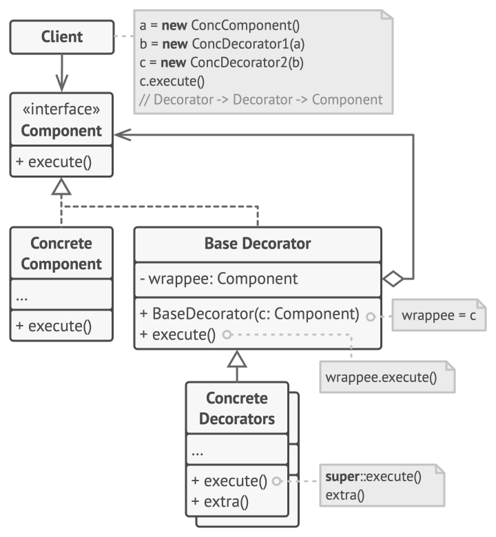
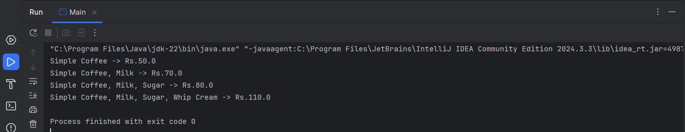

# Decorator Design Pattern (Coffee Customization Example)

This folder demonstrates the **Decorator Design Pattern** in Java using a **coffee customization system** example.

The Decorator Pattern is a **structural design pattern** that allows behavior to be added to individual objects **dynamically**, without affecting the behavior of other objects of the same class. It is especially useful when you want to add features or responsibilities incrementally.



---

## 🎯 Task / Problem Statement

Implement a coffee ordering system where different add-ons can be layered on top of a basic coffee.

### Requirements:
- Implement all required coffee and decorator classes.
- Add decorators to extend coffee functionality dynamically.
- Create a new decorator:
  - **WhipCreamDecorator** — adds "Whip Cream" to the description and **+30.0** to the cost.
- Test the final decorated coffee chain using **all decorators** in `Main.java`.

---

## System Components

### Component
- `Coffee` — defines the common interface for all coffee types.

### Concrete Component
- `SimpleCoffee` — represents a basic coffee without any add-ons.

### Base Decorator
- `CoffeeDecorator` — wraps a `Coffee` object and forwards requests.

### Concrete Decorators
- `MilkDecorator` — adds milk to the coffee.
- `SugarDecortor` — adds sugar to the coffee.
- `WhipCreamDecorator` — adds whip cream and increases cost.

### Client
- `Main` — builds and tests the decorated coffee chain.

---

## 🗂 Folder Structure

```
Decorator/
├── README.md
├── src/
│   ├── Coffee.java
│   ├── CoffeeDecorator.java
│   ├── Main.java
│   ├── MilkDecorator.java
│   ├── SimpleCoffee.java
│   ├── SugarDecortor.java
│   └── WhipCreamDecorator.java
├── img/
│   └── output1.png
└────────────────────────────────
```

- **`src/`** → Contains all Java source files for the Decorator pattern.
- **`img/`** → Contains sample output screenshot.

---

## ⚙️ How It Works

1. `SimpleCoffee` provides the base coffee.
2. Decorators wrap the coffee object one by one.
3. Each decorator adds its own description and cost.
4. The final object combines all added behaviors dynamically.

This approach avoids subclass explosion and keeps the design flexible and extensible.

---

## Sample Output

The final decorated coffee output can be seen below:



---
