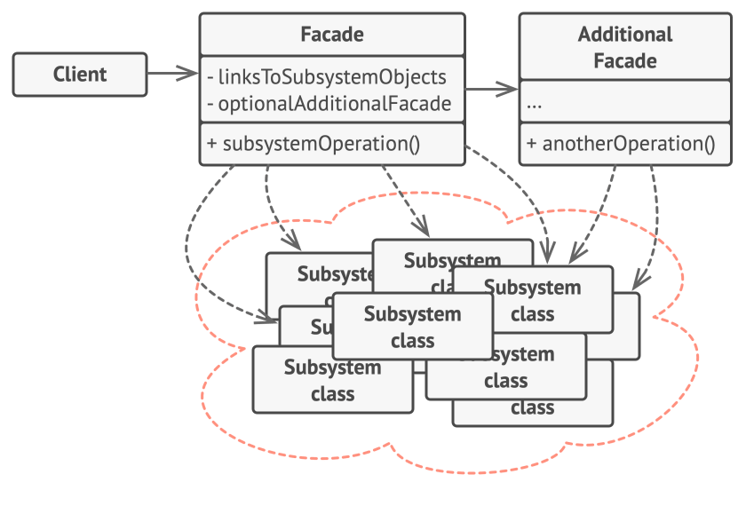
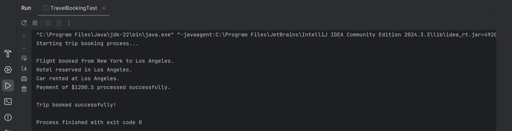

# Facade Design Pattern (Online Travel Booking System)

This folder demonstrates the **Facade Design Pattern** in Java using an **Online Travel Booking System** example.

The Facade Pattern is a **structural design pattern** that provides a **simplified interface** to a complex subsystem. It hides the complexities of multiple interacting classes and exposes a single, easy-to-use interface for the client.



---

## 🎯 Task / Problem Statement

Implement an **Online Travel Booking System** where booking a trip involves multiple services such as:
- Booking flights
- Reserving hotels
- Renting cars
- Processing payments

Managing these services individually can be complex for the client. Using the **Facade Design Pattern**, a single class (`TravelFacade`) provides a unified method (`bookTrip`) that handles the entire booking process while abstracting the underlying subsystem interactions.

---

## System Components

### Subsystem Classes
- `FlightBooking`
- `HotelBooking`
- `CarRental`
- `PaymentProcessor`

### Facade Class
- `TravelFacade` — provides a simple interface to coordinate all subsystems.

### Client Class
- `TravelBookingTest` — interacts only with the facade to book a trip.

---

## 🗂 Folder Structure

```
Facade/
├── README.md
├── src/
│   ├── CarRental.java
│   ├── FlightBooking.java
│   ├── HotelBooking.java
│   ├── PaymentProcessor.java
│   ├── TravelBookingTest.java
│   └── TravelFacade.java
├── img/
│   └── output1.png
└───────────────────────────────
```

- **`src/`** → Contains all Java source files for the Facade pattern implementation.
- **`img/`** → Contains sample output screenshot.

---

## ⚙️ How It Works

1. The client calls a single method (`bookTrip`) on `TravelFacade`.
2. The facade internally coordinates with multiple subsystems:
   - Books flights
   - Reserves hotels
   - Rents cars
   - Processes payment
3. The client remains unaware of the internal workflow, resulting in **reduced coupling** and **simplified usage**.

This approach improves maintainability and makes the system easier to use and extend.

---

## Sample Output

The result of booking a trip through the facade can be seen below:



---

