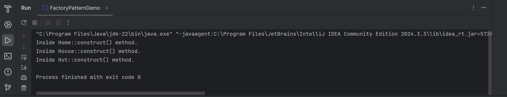

# Factory Method Pattern (Building Example)

This folder demonstrates the **Factory Method Design Pattern** in Java, using **Building types** (`Home`, `House`, `Hut`) as an example.  

The Factory Method is a **creational design pattern** that allows object creation **without exposing the instantiation logic** to the client. Objects are referenced through a common interface (`Building`), making the code flexible and easy to extend.

---

## 🎯 Task / Problem Statement

- Define a `Building` interface.  
- Implement concrete classes: `Home`, `House`, `Hut`.  
- Create a `BuildingFactory` class to generate building objects based on input.  
- Demonstrate usage via `FactoryPatternDemo` class.

This approach ensures that the **client code does not directly depend on concrete classes**, promoting loose coupling and scalability.

---

## 🗂 Folder Structure

```
Factory_Method/
├── README.md
├── src/
│   ├── Building.java
│   ├── Home.java
│   ├── House.java
│   ├── Hut.java
│   ├── BuildingFactory.java
│   └── FactoryPatternDemo.java
├── img/
│   └── output1.png
└──────────────────────────────
```

- **`src/`** → Contains all Java source files.  
- **`img/`** → Contains sample output screenshot.

---

## ⚙️ How It Works

1. **Interface Definition:**  
   `Building` defines the common blueprint for all building types.  

2. **Concrete Implementations:**  
   `Home`, `House`, and `Hut` implement the `Building` interface with their own behaviors.  

3. **Factory Class:**  
   `BuildingFactory` decides **which building object to create** based on input (`Home`, `House`, `Hut`).  

4. **Demo Class:**  
   `FactoryPatternDemo` shows how to **obtain building objects through the factory** without directly creating instances of concrete classes.

---

## Output

The program output can be viewed below:



---
