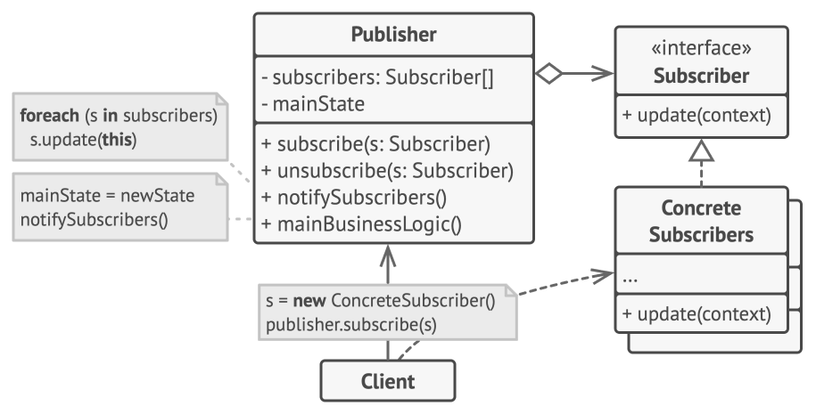
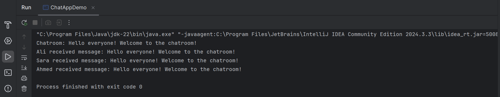

# Observer Design Pattern (Chat Application Example)

This folder demonstrates the **Observer Design Pattern** in Java using a **chat application** example.

The Observer Pattern is a **behavioral design pattern** that defines a one-to-many dependency between objects. When the state of one object (the subject) changes, all its dependent objects (observers) are notified and updated automatically.



---

## 🎯 Task / Problem Statement

Design and implement a **chat application** using the Observer Design Pattern with the following requirements:

1. **Subject Interface**
   - Define methods to add, remove, and notify observers.

2. **Observer Interface**
   - Define a method to update observers when a new chat message is received.

3. **Chatroom Class**
   - Implements the `Subject` interface.
   - Manages a list of observers (users).
   - Notifies all registered users when a new message is sent.

4. **User Class**
   - Implements the `Observer` interface.
   - Displays messages received from the chatroom.

5. **Main Application**
   - Demonstrates functionality by creating a chatroom, adding users, and sending messages.

---

## System Components

### Subject
- `Subject` — declares methods for attaching, detaching, and notifying observers.

### Observer
- `Observere` — defines the update method for receiving messages.

### Concrete Subject
- `Chatroom` — sends notifications to users when messages are posted.

### Concrete Observer
- `User` — receives and displays chat messages.

### Client
- `ChatAppDemo` — sets up the chatroom and simulates message flow.

---

## 🗂 Folder Structure

```
Observer/
├── README.md
├── src/
│   ├── ChatAppDemo.java
│   ├── Chatroom.java
│   ├── Observere.java
│   ├── Subject.java
│   └── User.java
├── img/
│   ├── observer_diagram.png
│   └── output1.png
└────────────────────────────────
```

- **`src/`** → Contains all Java source files for the Observer pattern.
- **`img/`** → Contains the observer diagram and sample output screenshot.

---

## ⚙️ How It Works

1. Users subscribe to the chatroom.
2. When a message is sent, the chatroom notifies all subscribed users.
3. Each user receives and displays the message independently.
4. Users can be added or removed dynamically at runtime.

This design ensures **loose coupling** between the chatroom and users while enabling real-time message updates.

---

## Sample Output



---
