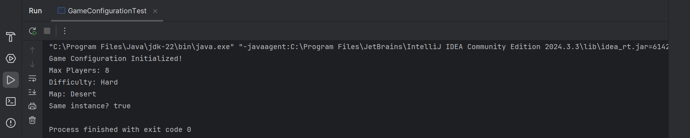
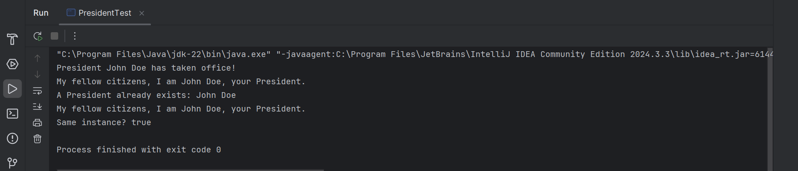

# Singleton Pattern

This folder demonstrates the **Singleton Design Pattern** in Java through two practical scenarios.

The Singleton Pattern is a **creational design pattern** that ensures a class has **only one instance** and provides a **global point of access** to that instance. It is commonly used when exactly one object is needed to coordinate actions across a system.

---

## 🎯 Tasks / Problem Statements

### Task 1: Game Configuration System

Design a **Game Configuration System** for a multiplayer game where configuration settings must be accessible across multiple modules, while avoiding the drawbacks of global variables.

#### Requirements:
- Ensure **only one instance** of the configuration manager exists.
- Provide **thread-safe initialization**.
- Allow getting and setting configuration values.
- Prevent re-initialization of an existing instance.

This task demonstrates a real-world use case of Singleton for managing shared configuration data.

---

### Task 2: President of the United States (Conceptual Example)

The office of the **President of the United States** is modeled as a Singleton.

- At any given time, there can be **only one active President**.
- The title "President of the United States" acts as a **global access point**, regardless of the individual holding the office.

This task closely follows the **classic Singleton checklist**:

1. A private static attribute holding the single instance.
2. A public static accessor method.
3. Lazy initialization (instance created on first use).
4. Private or protected constructors.
5. Clients access the instance only through the accessor method.

---

## 🗂 Folder Structure

```
Singleton/
├── README.md
├── task1/
│   ├── src/
│   │   ├── GameConfiguration.java
│   │   └── GameConfigurationTest.java
│   └── img/
│       └── output1.png
├── task2/
│   ├── src/
│   │   ├── President.java
│   │   └── PresidentTest.java
│   └── img/
│       └── output1.png
└──────────────────────────────────────
```

- **`task1/`** → Game Configuration Singleton implementation.
- **`task2/`** → Conceptual Singleton example using the President analogy.

---

## ⚙️ How It Works

- The Singleton class controls its own instantiation.
- A static accessor method returns the same instance every time.
- Constructors are restricted to prevent external object creation.
- Thread safety ensures correct behavior in concurrent environments.

Both tasks demonstrate how Singleton provides **controlled global access** while maintaining object integrity.

---

## Sample Output

### Task 1 Output



### Task 2 Output



---
